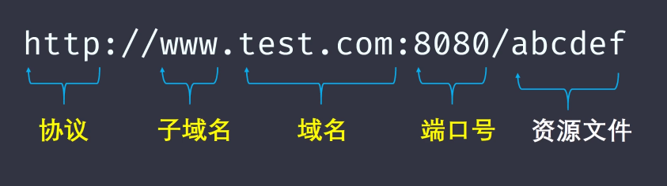

## HTML5+CSS3

### 一、前言

> HTML5 和 CSS3，分别指 HTML 的第五代版本标准 和 CSS 的第三代版本标准。
>
> 两者都是当前正在使用的最新版本 标准。
>
> 被推出的目的，肯定都是为了适应时代的发展，科技的进步，补充一些针对性的内容。

### 二、HTML5

**HTML5 主要新增的内容：**

- 新的语义化标签。如：`<header>` 和 `<section>`
- 新增用于 2D 绘图的 `<canvas>` 元素
- 新增本地存储方案（也称 web 存储对象）：`localStorage`  和  `sessionStorage`，以键对值得形式，存储字符串内容。
- 新增新的表单控件：如日历、日期和时间
- 新增获取用户地理位置的 api，可以检索用户所使用设备得当前地理位置
- 针对移动端，新增得新媒体功能。`video`  和 `audio`
- 针对用户体验，新增 应用缓存（AppCache)，可以使用户离线浏览。
- 针对性能体验，新增 Web Worker，相当于 主线程之外的多余线程。 
- 针对网络编程（客户端和服务端的轮询方案），新增 WebSocket ，全双工通讯协议。

> **可以发现，HTML5 版本新增的内容，不仅涉及了标签，还涉及一些功能API，这是其实是 W3C 组织进步的表现吧，作为开发者可以在不使用脚本的情况下，也能实现一些简单的功能。**

### 三、CSS3 

**css3 主要新增的内容：**

- **说起 css3，跟CSS2 对比，真的是小巫见大巫。**
- 首先，CSS3 给我们新增了很多元素选择器，你比如，属性选择器 和 结构伪类选择器。
- 然后，针对边框，新增了，圆角边框、边框阴影、边界图片。
- 针对 背景：背景图片、背景大小、背景裁切
- 针对花里胡哨：新增了渐变效果（线性渐变、径向渐变）、新增了文本效果（文本阴影、文本溢出）、新增了自定义字体
- 针对动画：新增了2D、3D旋转效果（可以对元素拉长、移动和缩放），新增了过渡效果 和 关键帧动画（flash 是逐帧动画 和补间动画。），关键帧动画其实也是类似的吧，先定义逐帧效果，然后再 animation 中，代入时间轨道。

- 除了刚才提到的这些内容外，CSS3 还有一个比较重要的概念，那就是 盒模型，关于元素宽高是否包含内边距边框。
- 还有就是，弹性盒子。给最外层元素指定 `display:flex`，元素就变成了弹性盒子，可以指定直接子元素的布局方式，摆放位置合间距，既方便，又省了一些代码。

### 四、Flex

**关于 flex ，其实现在网页布局基本上都离不开他。我简单说下，他几个重要的属性吧：**

- `flex-direction` : 指定项目的主轴方向，从左到右还是从右到左，从上到下，从下到上
- `flex-wrap` :  定义项目怎么换行。
- `justify-content` ： 定义项目在主轴上的对齐方式（左中右）
- `align-items`：定义项目在交叉轴怎么对齐。（上中下。）
- `align-content`: 定义多条轴线对齐方式。（左上，坐下，两端对齐）

- 刚才讲的是定义项目的，项目自身，也可通过属性来，调整排列顺序、容器空间大小、对齐方式等等。

### 五、水平垂直居中

- position定位（只适用于子盒子有宽度和高度的时候）
- position+transform（子盒子有或没有宽高的时候都适用）
- flex布局（弹性布局）（子盒子有或没有宽高的时候都适用）


》》


### 六、其他重要

**1、清除浮动：** 标签法和指定高度都不推荐，终极方案，伪元素或双伪元素清除浮动。

**2、BFC 特性:**  通俗一点来讲，可以把 BFC 理解为一个封闭的大箱子，箱子内部的元素无论如何翻江倒海，都不会影响到外部。

**只要元素满足下面任一条件即可触发 BFC 特性：**

- body 根元素
- 浮动元素：float 除 none 以外的值
- 绝对定位元素：position (absolute、fixed)
- display 为 inline-block、table-cells、flex
- overflow 除了 visible 以外的值 (hidden、auto、scroll)

**3、事件冒泡：** 点击元素，会优先查找自己身上，有没有绑定相关事件方法。如果没有，则直接往上级元素查找。如果上级有绑定，当你点击子元素的时候，就会触发上级身上绑定的事件。

使用 函数 内置参数 `event` 身上的方法，来组织事件冒泡。

```js
function (event) {
    event.stopPropagation();
}
```


## 闭包

### 一、前言

> **说起，闭包，什么是闭包？**
>
> 可以联系生活来理解，把书放进书包 ，把笔放进文具盒。这样形成密闭的隔离环境，不会受到外界干扰，这就是闭包。
>
> **再结合我们前端知识来说下我的理解**：
>
> 在生活中我们需要保护起来的东西，可以把它看成是一个对象，一个具有功能特性的对象，保护这个功能不会受到外界的影响。
>
> 在 程序的世界里，函数是一等公民，我们通过函数，来抽象的描述现实需求功能的工具。所以我们说到的闭包，其实也就是如何保护函数和函数里面的东西，或者说状态。
>
> **从前端开发者的角度，来考虑闭包的问题，势必跟执行上下文 和 作用域链，这两个知识点有关。所以考察闭包，也是同时考察这两个知识点。**

### 二、执行上下文

> **什么是执行上下文？**
>
> 这个概念有点抽象，按照咱们中国话来讲，执行上下文其实就是，当前 JavaScript 代码被解析和执行时所在环境。
>
> 又因为 JavaScript 代码在运行过程中，会为某些特定的变量、函数和对象，划定访问原则。这就产生了，全局作用域和局部作用域的说法。
>
> 所以这个执行上下文，也被分为：全局执行上下文、 函数执行上下文 以及 EVal 函数执行上下文。然后，又因为这个 Eval 函数上下文，很多资料都说，跟内存有关，慎用，前端也不咋用，所以此次面试，忽略不计。
>
> **全局执行上下文：**
>
> 全局执行上下文最基础的执行上下文，不在函数里面的代码，都位于全局上下文中。在全局上下文中主要做两件事：（1）创建全局对象，在浏览器中就是 window （2）将 this 指向这个全局对象。一个程序只能有一个全局执行上下文。
>
> **函数执行上下文：**
>
> 每次调用改函数时，都会为该函数创建一个新的执行上下文。每个函数都有自己的执行上下文，但是只有在函数被调用时，才会创建。一个程序可以有，可以有任意数量的执行上下文。
>
> **总的概况，执行上下文包括三个生命周期：创建阶段、执行阶段、回收阶段。**
>
> **创建阶段主要内容是：** 
>
> - 创建变量对象
> - 创建作用域链
> - 确定 this 执行，运行时绑定 this
>
> **执行阶段：** 执行变量赋值，执行代码
>
> **回收阶段：** 上下文出栈，等待引擎回收执行上下文

### 三、执行上下文栈

见上我们可知，函数多了，就有多个执行上下文，每次调用函数创建一个新的执行上下文。

那么， JavaScript 引擎是如何管理创建这么多执行上下文的呢？

> JavaScript 引擎 创建了执行上下文栈来管理执行上下文。
>
> **可以把执行上下文栈认为是一个存储函数调用栈的结构，遵循先进后出的原则**
>
> 
>
> 从上面的流程图，我们需要记住以下几个关键点：
>
> - JavaScript 执行在单线程上，所有的代码都是排队执行。
> - 一开始浏览器执行全局的代码时，首先会创建全局的执行上下文，压入执行栈顶部。
> - 每当进入一个函数的执行就会创建函数的执行上下文，并且把它压入执行栈的顶部。当前函数执行完成后，当前函数的执行上下文出栈，并等待垃圾回收。
> - 浏览器的 JS 执行引擎总是访问栈顶的执行上下文。
> - 全局上下文只有唯一的一个，它在浏览器关闭时出栈。
>
> **我们再看下面的栗子，帮助理解下：**
>
> ```js
> var color = 'blue';
> function changeColor() {
>     var anotherColor = 'red';
>     function swapColors() {
>         var tempColor = anotherColor;
>         anotherColor = color;
>         color = tempColor;
>     }
>     swapColors();
> }
> changeColor();
> ```
>
> 上述代码的运行按照如下步骤：
>
> - 当上述代码在浏览器加载时，JavaScript 引擎会创建一个全局执行上下文并且将它推入当前的执行栈
> - 调用 changeColor 函数时，此时 changeColor 函数内部代码还未执行，JS 执行引擎立即创建一个 changeColor 的执行上下文（简称 EC），然后把这执行上下文压入到执行栈（简称 ECStack）中。
> - 执行 changeColor 函数过程中，调用 swapColors 函数，同样地，swapColors 函数执行之前也创建一个 swaoColors 的执行上下文，并压入到执行栈中。
> - swapColors 函数执行完成，swapColors 函数的执行上下文出栈，并且被销毁。
> - changeColors 函数被执行完成，changeColor 函数的执行上下文出栈，并且被销毁。
>
> 


### 四、总结闭包

**（1）闭包是将函数内部和函数外部连接起来的桥梁**

**（2）闭包发生在函数内部，目的是保护某些变量，不会被外界干扰或引用**

**（3）闭包是利用了执行上下文和作用域链，即：函数内部可以访问函数外部，但是函数外部缺不能访问函数内部的变量（状态）**

**（4）常见的闭包，有下面两种情况。**


### 五、常见闭包两种情况

> **以下两种情况的示例，都是通过判断 a 的 console 值来 理解作用域这一概念。**

**（1）函数作为返回值**

```js
function test() {
    const a = 1;
    return function() {
        console.log('a', a);
    }
}

const fn = test();
const a = 2;
fn();   // 我们判断 test 函数里面的 console.log 语句打印的是哪个a
```

**（2）函数作为参数**

```js
function test(fn) {
    const a = 1;
    fn();
}

const a = 2;
function fn() {
    console.log('a',a);
}
test(fn); 

// 注意，这个示例，这里 console.log('a',a) => 'a',2
// a 的取值是2，所以你要知道，函数的声明和调用是分开的
// 被调用函数的状态，优先在当前声明函数的作用域查找
```


## 异步方案

### 一、Event Loop

> **事件循环是 JS 基础最为重要的知识点之一，我们需要认真的理解 **

- **创建一段代码**

```js
  /* 我们知道，JS 引擎解析执行代码是 自上而下的 */
   console.log('xierukun.com');
   
   setTimeout(function callback(){
       console.log('我是一个异步回调函数！');
   }, 3000);

   console.log('xierukun.cn');
```

- **代码被解析、执行的过程是：Js 预处理器将 全局执行上下文的代码，放入全局执行上下文栈，代码被解析 => JS引擎自上而下，将每个执行语句，加载到 `call Stack` 调用栈中 执行代码 => 一般情况下，同步语句会直接被执行掉，并清空调用栈 => 如果遇到异步代码，例如 定时器，会将其暂时放入浏览器的 webAPIs 线程中管理，等待同步代码都指向完毕后 => JS引擎再去访问 WebAPIS 线程，获取到相关定时任务结束的代码。  **

- **参照下面这幅图进行理解：**


- **首先第一行代码，已经被执行掉了，直接在控制台打印输出 => 第二行代码，注意，所有异步操作的声明，都是同步的 ，所以也是先加载到调用栈中 => 第二行代码被放入调用栈执行，判断为异步操作，放入 webApIs 线程中 => JS 引擎接着往下执行，第三条语句**


- **在浏览器 Web APIs 的定时器管理模块中，3s 后，会将回调函数，放入到 `Callback Queue` 中**


- **<font color="red">Event Loop</font> 的状态是一直在轮询 Callback Queue 的**


- **当 <font color="red">Event Loop</font> 轮询到 Callback Queue 中有记录，则把回调函数推到调用栈中执行 **


### 二、宏任务和微任务

> 在上面我们讲到 了 Event Loop (事件循环)，我们先来梳理下，大概流程：
>
> - 当 JS 引擎开始解析我们的代码时，可以分为两个阶段，预编译阶段 和执行阶段。
> - 预编译阶段的主要动作是，创建上下文执行栈，也就是代码执行环境。主要工作是，创建变量对象，创建全局对象，把this 指向全局对象。
> - 执行阶段，把代码从全局上下文执行栈中，一个表达式一个表达式，加载到 调用栈中执行。（中国人都知道 JS 是单线程，也就是只有一个调用栈），在执行阶段，如果遇到是异步的对象，比如定时器，则将该段回调函数，放置浏览器 webAPIs 模块中管理。（详见上面几幅图）
> - **异步操作最终会放到任务队列中，排队等待重新进入主线程（调用栈）被执行掉。而这个异步的任务队列，也被分成宏任务队列 和 微任务队列。**

**！！！ 微任务队列 会在 宏任务队列 之前被执行。只有微任务队列被清空，才会去访问 宏任务。**

**常见宏任务：**

- **新程序或子程序被直接执行**
- **事件的回调函数**
- **setTimeout() 和 setInterval()**

**常见的微任务有：**

- **Promise.then() .catch() . finally()**
- **MutationObserver**
- **Object.observe**

**注意的是：微任务虽然调用的优先级大于宏任务，但是异步任务队列的起点在宏任务。执行完一次宏任务后，下一次必须执行清空完微任务队列。值得注意的是：新程序也被归为宏任务，大致流程如下：**

**清空同步任务 => 宏任务（script 标签）=> 微任务清空=>宏任务=> 是否还有微任务**

 

### 一、使用 Promise 加载图片

> **在了解前端都有哪些常见的异步方案之前，我们先了解下，现在比较成熟的异步方法案例**

```js
function loadImage(src) {
    const promise = new Promise ((resolve,reject) => {
        const img = document.createElement('img');
        img.onload = function() {
            resolve(img);
        }
        img.onerror = function() {
            const error = new Error('图片加载失败，url为 ${url}')
            reject();
        }
        img.src = src;
    });
    
    reurn promise;
}

const url1 = 'https://xierukun.com/images/user.png'
loadImage(url1).then(img => {
    console.log('img', img)
}).catch(e =>{
    console.log('error', e);
})
```


### 三、Promise 的三种状态

> Promise 是 ES6 新增 最为广泛应用的异步方案。
>
> 在学习使用 Promise 时，我们需要了解到 它的一些概念。
>
> **（1）Promise 是异步编程的一种解决方案，比传统的解决方案——回调函数和事件——更合理和更强大。它由社区最早提出和实现，ES6 将其写进了语言标准，统一了用法，原生提供了`Promise`对象。**
>
> **（2）所谓`Promise`，简单说就是一个容器，里面保存着某个未来才会结束的事件（通常是一个异步操作）的结果。从语法上说，Promise 是一个对象，从它可以获取异步操作的消息。Promise 提供统一的 API，各种异步操作都可以用同样的方法进行处理。**

**`Promise`对象有以下两个特点：**

- **对象的状态不受外界影响。**Promise 对象代表一个异步操作，有三种状态：`pending` （进行中）、`fulfilled` （已成功）和 `rejected`（已失败）。只有异步操作的结果，可以决定当前是哪一种状态，任何其他操作都无法改变这个状态。这也是 promise 这个名字的由来，它的英语意思是 “承诺”，表示其他手段无法改变。
- **一旦状态改变，就不会再变，任何时候都可以得到这个结果。** `Promise` 对象的状态改变，只有两种可能：从 进行中（`pending`） 变为成功（`fulfilled`） 或者 从进行中（`pending` ） 变成 失败（`rejected`）。只要这两种情况发生，状态就凝固了，不会再变，会一直保持这个结果，这时就称为 `resolved` （已定型）。如果改变已经发生了，你再对 `Promise` 对象添加回调函数，也会立即得到这个结果。

```js
const promise = new Promise(function(resolve,reject) { // 成功 or 失败 的两种状态
    
    // 注意了，创建 promise 时，这里的表达式为同步代码 
    
    if (/* 异步操作成功 */) {
       resolve(value)  
    } esle {
        reject(error);
    }
})
```


## 深浅拷贝

### 一、为什么需要深浅拷贝

> **在我们生活当中：**
>
> 如果需要修改一个重要文件，一般情况下，防止出错，我们会对重要文件进行拷贝，作为留底参照，避免损坏文件原有的重要信息。
>
> **在我们实际工作当中：**
>
> 如果需要两个或多个初始值相同的变量，在发生修改后互不干扰，这时候，我们也需要拷贝。
>
> **再简单理解下，深浅拷贝其实就是：**
>
> **我们拷贝一个初始变量，得到一个或多个同值得初始化变量。**
>
> **如果其中一个变量值发生改变，影响到其它变量值，此时拷贝的类型，属于浅拷贝，拷贝的是引用关系，相当于拷贝指针。**
>
> **如果其中一个变量值发生改变，并没有影响到其它变量值的修改，此时拷贝的类型，属于深拷贝，相当于复制整个初始变量值。与初始变量，完全属于两个物种。**

### 二、栈空间 和堆空间

> **考察拷贝的知识点，其实也主要涉及到了内存空间的知识点吧：**
>
> 在 JavaScript 这门语言当中，内存空间的调度和使用，又和 三种数据结构有关。
>
> **分别是：栈（stack）、堆（heap）以及队列（queue）**
>
> 联系到 JavaScript 这些数据结构相关的专业名词，咱们也如雷贯耳
>
> **上下文执行栈、保存复杂数据类型的堆空间、以及任务队列。（后端有个 MQ，消息队列）**

**简单的理解栈空间和堆空间**

简单的说下 栈空间和 堆空间吧，因为 JavaScript 这玩意，是脚本语言，脚本语言没有太多弯弯绕的，开箱即用，我见即我得。


> JavaScript 在创建执行上下文的时候，会创建一个叫  **变量对象** 的东西，用于保存变量的初始化。
>
> 其实在 JavaScript 的内存空间，很多参考资料，都说栈的概念不太明显，因为你比如 红宝石书中，我记得就明确指出，变量的初始化值是放在变量对象上。但是也有相关资料，说的，其实变量对象是保存在栈空间。这点就不过多细究了。大致意思就是：
>
> **简单的数据类型的数据，可以直接保存在栈空间，也就是变量对象身上。**
>
> **而复杂的数据类型，比如 数组、对象、函数、集合等包含多个数据值的类型，是存放到堆空间，由栈空间保存堆空间的内存地址，通过类似 C语言中的指针操作，由栈空间指向堆空间。或者说，栈空间，引用堆空间中的数据。**
>
> **JS 引擎工作的时候，就是通过访问上下文栈，来依此加载到主线程，进行执行。**

### 三、深浅拷贝与堆栈空间

> 然后，说回深浅拷贝。
>
> 深浅拷贝的本质，其实就是：
>
> - **浅拷贝直接复制整个变量对象身上的值，包含，指向堆空间的内存地址**
> - **深拷贝，则直接拷贝堆空间的值，并且生产新的内存地址，存放在栈（变量对象中）**

### 四、深浅拷贝的方法

**（1）浅拷贝**

- 使用 ES6 提供的 `Object.assign()` ，将所有可枚举的属性值从一个或者多个源对象赋值到目标对象，然后返回目标对象。
- 使用展开运算符 `...`  展开一个对象

```js
let obj = {
    a: '1',
    b: '2',
    c: '3'
}

let cobj = {...obj}
```

- 数组的浅拷贝 `array.slice(start, end)` 和 `Array.prototype.concat()` ，其实这两个方法也是由争议的，因为他们第一层是深拷贝，但是后面都是复制引用关系。**其实就是，只能修改到指定的数据，其它数据都是直接拷贝引用。**

**（2）深拷贝 **

- 利用 `JSON.stringify` 和 `JSON.parse` ；先把 对象转化成字符串，然后再把字符串转换成对象。就实现了深拷贝。=> **仅适用于 对象身上**
- 利用第三方工具库封装的方法。`jquery` 的 `extend` 和 `lodash`的 `cloneDepp`
- 然后使用 递归的方法

   

## 跨域

### 一、什么是跨域

> **当一个请求 url 的协议、域名、端口三者之间任意一个与当前页面 url 不同即为跨域。**



**（1）什么是同源策略**

> **同源策略/SOP （Same origin policy）是一种约定，由 Netscape（网景）公司在1995年引入浏览器，它是浏览器最核心也是最基本的安全功能。 **
>
> **如果缺少了同源策略，浏览器很容易受到 XSS（跨站脚本攻击）、CSFR（跨站请求伪造） 等攻击。**
>
> **所谓同源是指：“ 协议+域名+端口” 三者相同，即使两个不同的域名指向同一个 IP 地址，也非同源。**

**（2）HTML 特殊标签**

`<link>` 、`<script>`、``、`<frame> ` 等这些标签具有跨域特性，可以直接访问。

 ### 二、处理跨域的方案

- **Jsonp**

- **Proxy 代理**

- **CORS （服务器端解决）**

- **Nginx 反向代理**

- **Websocket**

- **postMessage**

  ...

### 三、Jsonp

> **利用 script 标签，远程动态的加载 JS 代码**

**使用 JSonp 方法，需要前后端先相互约定，前端通过 `script` 标签请求跨域的域名，后端获取请求，返回相关回调方法。**

**示例1**

```html
<script>
function test() {
    alert('定义了一个方法,但是没有触发')
}
</script>

<!-- 利用 script 标签跨域，向跨域域名发起请求  -->
<script src="https://xierukun.com/index/kun"> </script> 

<!-- 注意了，上面的 script 请求，相当于是 后端返回一段代码给前端
     所以，test() 也是可以代参数滴，你把它看成实参调用 function test(a){} 
     => test('132')   -->
```

```php
public function kun() {
    return "test();"; // 后端接收到前端请求，返回相关内容
}
```

**此时，页面成功执行 test() 的调用方法。**

**示例 2**

> 示例2 和 示例1 类似，不同的是，前端请求 跨域 URL ，携带参数 callback
>
> **我们考古一些老的网站，你会发现，url  后面 紧跟着 callback 接着是一大堆字符串，那就可能利用了 Jsonp 来进行跨域**

```html
<script>
function test() {
    alert('定义了一个方法,但是没有触发')
}
</script>

<!-- 利用 script 标签跨域，向跨域域名发起请求  -->
<script src="https://xierukun.com/index/kun?callback=test"> </script> 
```

```php
public function kun() {
    $callback = $_GET["callback"]; // PHP 方法，获取前端 get 请求参数
    return $callback.'(123)'; // 后端接收到前端请求，返回相关内容
}
```

**示例 3**

> 示例3 利用第三方库，来实现 JSonp 请求

```html
<script src="https://cdnjs.cloudflare.com/ajax/libs/jquery/3.6.0/jquery.min.js"></script>、

<script>
$.ajax({
   type: "get",
    url: "https://xierukun.com/index/kun",
    dataType: "jsonp", // 注意，这里不是 JSON，而是 JSonp
    success: function (res) {
        console.log(res)
    }
});
</script>

<!-- 相当于 Jquery 帮我们自动处理了 -->

```

**注意，不管用原生还是第三方库，都需要跟后端约定好！**

###  四、CORS 

> 此方案只需要服务器设置 ，**`Access-Control-Allow-Origin` 即可** 前端无需设置。
>
> 若要带 cookie 请求，前后的都要设置

```php
header("Access-Control-Allow-Origin: *"); // * 代表允许所有请求 url
```

*翻译白话：后端配置，访问控制器允许的源，设置成 通配符，任意

### 五、代理 Proxy 

> **通过中间件来实现，浏览器有跨域限制，但是服务器没有跨域限制，所以中间件其实就是服务器。=> 服务器对数据进行了转发而已**


**在 Vue 中使用 代理的方法，实现跨域**

> Vue 是现在前端炙手可热的三大框架之一。
>
> Vue 框架中解决跨域的方式是：

- 创建 `vue.config.js` 文件

```sh
touch vue.config.js
```

- 编辑 `vue.config.js` 文件

```js
module.exports = {
     
    // 开发环境配置
    devServer: {
        proxy: {
            '/': {
                target: 'https://xierukun.com/';
                changeOrigin: true;
            }
        }             
    }
}

// 相当于Vue 在所有 http 请求之前，添加了 `https://xierukun.com`
```

### 六、Nginx 反向代理

```nginx
# proxy 服务器
server {
   listen			80;
   server_name		www.a.com;
   
   location / {
   		proxy_pass 		http://www.b.com # 反向代理
   		proxy_cookie_domain www.b.com www.a.com;
   		index index.html index.htm;
   		
   		add_header Access-Control-Allow-Origin http://www.a.com;
   		add_header Access-Control-Allow-Credentials true;
   
   }
}
```


## 性能优化

> **说起性能优化，首先第一个问题什么是性能优化？**
>
> **下面，我谈一谈个人的理解：**

**性能优化，它是一个专业名词。在生活中，我们经常讲到手机性能优化、电脑性能优化；在我们程序员的世界，我们又经常讲到，前端性能优化和后端性能优化。**

**我个人对性能优化定义的标准，理解为：节约资源，提高效率，使占有资源最小化，工作效率最大化。**

**对于我的理解，需要做好性能优化，需围绕两个角度，展开思考：时间角度和空间角度。**

**作为一名前端程序员，后端知识，也需要有一定的了解。我先快速，讲下后端的性能优化：**

- **首先，从空间的角度上：服务器的内存优化、控制I/O流；建立分布式架构，高并发，低耦合等等，这些都是性能优化的措施。提高工作的效率。**
- **从时间的角度上讲：设置服务器、数据库缓存，使用ng代理缓存，http缓存，使用redis缓存服务器，等待一系列为了减少请求次数，节约内存访问和计算时间的操作。都是性能优化。**

**然后就是，性能优化，他是一个非常大的话题。怎么说呢，性能优化，它是相对于某个问题对象来讲的，可能性能优化的对象本身也能作为性能优化的对象。**

**什么意思呢？你比如，面对带宽占有，请求访问量巨大的问题，我们推出了分布式架构，来解决性能的问题。但是，分布式架构作为一个对象，还有更细的性能优化的点。**

###  一、前端性能优化

> **言归正传，我讲下，前端当中的性能优化：**
>
> **首先，从大的方面讲，前端性能在性能优化方便，做了哪些：**
>
> **对于前端来说，其实空间都角度不会那么敏感。对于服务器来说，内存运存，是非常重要的，而对于前端来说，就没有那么明显了。**

- 浏览器的缓存策略：通过 强缓存和协商缓存等手段，缓存一些 静态资源 和 一些常用的信息，有效减少了请求次数和请求时间。
- 使用前后端分离架构：无论是动态数据还是页面路由跳转，都减少了客户端对服务端的依赖。
- 采用最新技术方案：HTML5提供的 APP Cache 和 新的全双工通讯协议（WebSocket），ES6 提供的异步编程方案，第三方框架，提供的虚拟DOM 和 diff  算法。
- 使用合理静态资源：比如 webp、svg  格式的图片，或者使用（雪碧）精灵图，利用 cdn 技术，引用相关资源。
- 通过懒加载和预加载，控制页面内容的渲染；通过节流和防抖控制事件频繁触发；通过事件委任减少事件注册和内存占有。

等等

**我认为，性能优化的问题，并没有标准答案。任何项目都存在精益求精的部分，具体问题，具体分析。**

### 二、从 URL 输入到页面渲染

> **我看了下，现在市场上，对于大多数关于性能优化的面试题，不知道是哪个大佬提供出来的标准答案。回答的点，大概有两部分，第一，从 URL输入 到前端页面渲染发生了哪些事情；第二，回答一些常用的性能优化手段（当然，我刚才已经讲到了一些大概）	**
>
> **下面我讲下，从 URL 输入到 前端页面渲染都发生了哪些事情**

- 用户在客户端输入 URL 地址，浏览器会拿到 URL 地址，发起 DNS 查找。查找规则是：优先查找本机DNS 缓存，如果本机没有，再去访问云服务商的 DNS 服务器。

- 访问 DNS，获取到 相对应域名的主机地址后，浏览器发起 http 请求。

- 请求到相对应的服务器，服务器接收到http 请求后，会和客户端建立 tcp 通道，也就我们说的 三次握手

- 在服务器确认与客户端通讯正常后，会响应 客户端的 http 请求内容

- 客户端接收 服务端过来的响应文件后，开始工作。html  文件，会被 JS 引擎渲染成 DOM 树，CSS 文件，会被 JS 引擎渲染层 层叠样式表。一般 JS 文件作为脚本，会被放置到代码底部，最后渲染。

- 响应过来的HTML 和 css 文件，加载就绪，浏览器的 GUI 线程，就开始工作了。将 DOM 和 层叠样式表结合，生成渲染树。

  

## Vu面试题

### （1）v-show 与 v-if 有什么区别？

- **v-if** 是**真正**的条件渲染，因为它会确保在切换过程中条件块内的事件监听器和子组件适当地被销毁和重建；也是**惰性的**：如果在初始渲染时条件为假，则什么也不做——直到条件第一次变为真时，才会开始渲染条件块。
- **v-show** 就简单得多——不管初始条件是什么，元素总是会被渲染，并且只是简单地基于 CSS 的 “display” 属性进行切换。
- 所以，v-if 适用于在运行时很少改变条件，不需要频繁切换条件的场景；v-show 则适用于需要非常频繁切换条件的场景。

### （2）怎样理解 Vue 的单向数据流？

> 所有的 prop 都使得其父子 prop 之间形成了一个**单向下行绑定**：父级 prop 的更新会向下流动到子组件中，但是反过来则不行。这样会防止从子组件意外改变父级组件的状态，从而导致你的应用的数据流向难以理解。
>
> 额外的，每次父级组件发生更新时，子组件中所有的 prop 都将会刷新为最新的值。这意味着你不应该在一个子组件内部改变 prop。如果你这样做了，Vue 会在浏览器的控制台中发出警告。子组件想修改时，只能通过 $emit 派发一个自定义事件，父组件接收到后，由父组件修改。

### （3）computed 和 watch 的区别和运用的场景？

>  computed 强调计算
>
>  watch 强调观察

**computed：** 是计算属性，依赖其它属性值，并且 computed 的值有缓存，只有它依赖的属性值发生改变，下一次获取 computed 的值时才会重新计算 computed 的值；

**watch：** 更多的是「观察」的作用，类似于某些数据的监听回调 ，每当监听的数据变化时都会执行回调进行后续操作；

当我们需要进行数值计算，并且依赖于其它数据时，应该使用 computed，因为可以利用 computed 的缓存特性，避免每次获取值时，都要重新计算；

### （4）直接给一个数组项赋值，Vue 能检测到变化吗？

**由于 JavaScript 的限制，Vue 不能检测到以下数组的变动：**

- 当你利用索引值直接设置一个数组项时。例如：`vm.items[indexOfItem] = newValue`
- 当你修改数组的长度时，例如：`vm.items.length = newLength`

**为了解决第一问题：可以使用 Vue.set 方法去修改数组**

```js
// Vue.set
Vue.set(vm.items, indexOfItem, newValue)
// vm.$set，Vue.set的一个别名
vm.$set(vm.items, indexOfItem, newValue)
// Array.prototype.splice
vm.items.splice(indexOfItem, 1, newValue)
```

**为了解决第二个问题：**

```js
// Array.prototype.splice
vm.items.splice(newLength)
```

### （5）在哪个生命周期内调用异步请求？

可以在钩子函数 created、beforeMount、mounted 中进行调用，因为在这三个钩子函数中，data 已经创建，可以将服务端端返回的数据进行赋值。但是本人推荐在 created 钩子函数中调用异步请求，因为在 created 钩子函数中调用异步请求有以下优点：

- 能更快获取到服务端数据，减少页面 loading 时间；
- ssr 不支持 beforeMount 、mounted 钩子函数，所以放在 created 中有助于一致性；

### （6）谈谈你对 keep-alive 的了解？

keep-alive 是 Vue 内置的一个组件，可以使被包含的组件保留状态，避免重新渲染 ，其有以下特性：

- 一般结合路由和动态组件一起使用，用于缓存组件；
- 提供 include 和 exclude 属性，两者都支持字符串或正则表达式， include 表示只有名称匹配的组件会被缓存，exclude 表示任何名称匹配的组件都不会被缓存 ，其中 exclude 的优先级比 include 高；
- 对应两个钩子函数 activated 和 deactivated ，当组件被激活时，触发钩子函数 activated，当组件被移除时，触发钩子函数 deactivated。

### （7）组件中 data 为什么是一个函数？

> 因为组件是用来复用的，且 JS 里对象是引用关系，如果组件中 data 是一个对象，那么这样作用域没有隔离，子组件中的 data 属性值会相互影响，如果组件中 data 选项是一个函数，那么每个实例可以维护一份被返回对象的独立的拷贝，组件实例之间的 data 属性值不会互相影响；而 new Vue 的实例，是不会被复用的，因此不存在引用对象的问题。
>
> **跟数据的内存引用关系相关**

### （8）v-model 的原理？

我们在 vue 项目中主要使用 v-model 指令在表单 input、textarea、select 等元素上创建双向数据绑定，我们知道 v-model 本质上不过是语法糖，v-model 在内部为不同的输入元素使用不同的属性并抛出不同的事件：

- text 和 textarea 元素使用 value 属性和 input 事件；
- checkbox 和 radio 使用 checked 属性和 change 事件；
- select 字段将 value 作为 prop 并将 change 作为事件。

```js
<input v-model='something'>
    
相当于

<input v-bind:value="something" v-on:input="something = $event.target.value">
```

### （9）Vue 组件间通信有哪几种方式？

Vue 组件间通信只要指以下 3 类通信：**父子组件通信**、**隔代组件通信**、**兄弟组件通信**，下面我们分别介绍每种通信方式且会说明此种方法可适用于哪类组件间通信。

- 使用 `props` 和 `$emit`，**实现父子组件通信**
- 使用 `ref` 与 `$parent` / `$children` **，实现父子组件通信**
  - `ref`：如果在普通的 DOM 元素上使用，引用指向的就是 DOM 元素；如果用在子组件上，引用就指向组件实例
  - `$parent` / `$children`：访问父 / 子实例

- 使用 **EventBus（$emit / $on） 适用于 父子、隔代、兄弟组件通信**

这种方法通过一个空的 Vue 实例作为中央事件总线（事件中心），用它来触发事件和监听事件，从而实现任何组件间的通信，包括父子、隔代、兄弟组件。

- **`$attrs`/`$listeners` 适用于 隔代组件通信**
  - `$attrs`：包含了父作用域中不被 prop 所识别 (且获取) 的特性绑定 ( class 和 style 除外 )。当一个组件没有声明任何 prop 时，这里会包含所有父作用域的绑定 ( class 和 style 除外 )，并且可以通过 `v-bind="$attrs"` 传入内部组件。通常配合 inheritAttrs 选项一起使用。
  - `$listeners`：包含了父作用域中的 (不含 .native修饰器的)  v-on 事件监听器。它可以通过 `v-on="$listeners"` 传入内部组件
- **`provide / inject` 适用于 隔代组件通信**

祖先组件中通过 provider 来提供变量，然后在子孙组件中通过 inject 来注入变量。 provide / inject API 主要解决了跨级组件间的通信问题，不过它的使用场景，主要是子组件获取上级组件的状态，跨级组件间建立了一种主动提供与依赖注入的关系。=> 相当于，遗传基因，祖宗组件有的，不断隔了多少代，都能获取到。

- **Vuex 适用于 父子、隔代、兄弟组件通信**

Vuex 是一个专为 Vue.js 应用程序开发的状态管理模式。每一个 Vuex 应用的核心就是 store（仓库）。“store” 基本上就是一个容器，它包含着你的应用中大部分的状态 ( state )。

 - Vuex 的状态存储是响应式的。当 Vue 组件从 store 中读取状态的时候，若 store 中的状态发生变化，那么相应的组件也会相应地得到高效更新。
 - 改变 store 中的状态的唯一途径就是显式地提交  (commit) mutation。这样使得我们可以方便地跟踪每一个状态的变化。

### （10）你使用过 Vuex 吗？

Vuex 是一个专为 Vue.js 应用程序开发的状态管理模式。每一个 Vuex 应用的核心就是 store（仓库）。“store” 基本上就是一个容器，它包含着你的应用中大部分的状态 ( state )。

（1）Vuex 的状态存储是响应式的。当 Vue 组件从 store 中读取状态的时候，若 store 中的状态发生变化，那么相应的组件也会相应地得到高效更新。

（2）改变 store 中的状态的唯一途径就是显式地提交 (commit) mutation。这样使得我们可以方便地跟踪每一个状态的变化。

主要包括以下几个模块：

- State：定义了应用状态的数据结构，可以在这里设置默认的初始状态。
-  Getter：允许组件从 Store 中获取数据，mapGetters 辅助函数仅仅是将 store 中的 getter 映射到局部计算属性。
- Mutation：是唯一更改 store 中状态的方法，且必须是同步函数。
- Action：用于提交 mutation，而不是直接变更状态，可以包含任意异步操作。
- Module：允许将单一的 Store 拆分为多个 store 且同时保存在单一的状态树中。

### （11）Vue 是如何实现数据双向绑定的？

>  **Vue 数据双向绑定主要是指：数据变化更新视图，视图变化更新数据**
>
> **其中，View 变化更新 Data ，可以通过事件监听的方式来实现**
>
> **所以 Vue 的数据双向绑定的工作主要是如何根据 Data 变化更新 View。**

**Vue 主要通过以下 4 个步骤来实现数据双向绑定的：**

- **创建一个监听器 Observer**：对数据对象进行遍历，包含子属性对象的属性，利用 Object.defineProperty() 身上的 setter 和 getter 方法，改变对象的值，就会触发 setter，那么就可以监听到数据的变化。
- **创建一个解析器 Compile**：解析 Vue 模板指令，将模板中的变量都替换成数据，然后初始化渲染页面视图，并将每个指令对应的节点绑定更新函数，添加监听数据的订阅者，一旦数据有变动，收到通知，调用更新函数进行数据更新。
- **创建一个订阅者 Watcher：** Watcher 订阅者是 Observer 和 Compile 之间通信的桥梁，主要的任务是订阅 Observer 中的属性值变化的消息，当收到属性值变化的消息时，触发解析器 Compile 中对应的更新函数。
- **创建一个 订阅器 Dep：** 订阅器采用 发布-订阅 设计模式，用来收集订阅者watcher,对监听器Observer 和 订阅者watcher 进行管理。 

### （12）Proxy 与 Object.defineProperty 优劣对比

**Proxy 的优势如下:**

- Proxy 可以直接监听对象而非属性；
- Proxy 可以直接监听数组的变化；
- Proxy 有多达 13 种拦截方法,不限于 apply、ownKeys、deleteProperty、has 等等是 Object.defineProperty 不具备的；
- Proxy 返回的是一个新对象,我们可以只操作新的对象达到目的,而 Object.defineProperty 只能遍历对象属性直接修改；
- Proxy 作为新标准将受到浏览器厂商重点持续的性能优化，也就是传说中的新标准的性能红利；

**Object.defineProperty 的优势如下:**

- 兼容性好，支持 IE9，而 Proxy 的存在浏览器兼容性问题,而且无法用 polyfill 磨平，因此 Vue 的作者才声明需要等到下个大版本( 3.0 )才能用 Proxy 重写。


## Promise

> 说起Promise 的用途，我听得最多的是，可以解决回调地狱。
>
> 其实在 ES6 中，给我们提供了三种方法，用于解决回调地狱的问题。
>
> - 生成器 Generator 函数
> - Promise 
> - Async

**Promise 有三种状态：进行中（Pending）、成功（Resolved）、失败（rejected）**

我们通常封装一个异步操作的时候，声明一个函数，返回一个 Promise，类似闭包。

```js
function fn() {
    return new Promise((res,rej) => {
        xxx
    });
}
```

**promsie 还可以简写哦：**

```js
const p = promise.resolve(); // new Promise(resolve=> return resolve())
```

**Promsie,all 可以用于，指定的 promise 都是 resolve 状态，才能.then（）成功。否则catch **

```js
const p1 = new Promise((resolve,resject));
const p2 = new Promise((resolve,resject));
const p3 = new Promise((resolve,resject));

let p_all = promise.all([p1,p2,p3]); // 需要同时满足的条件
p_all.then();

// 利用 promise 实现多条件判断
```

**利用 Promise.race()，方法，给异步请求设置超时时间，并且在超时后执行相应的操作**

**使用 finally 和 done ,可以追加一段必须走的代码。例如关闭服务响应。**


## async 

> **使用 async 关键字，使异步操作变得更简单。**
>
> 我们只需要在函数声明时，前面加上 async 关键字，该函数就变为异步方法。
>
> **通过 async 关键字标识的函数，会返回一个 Promise 对象**
>
> 很多资料说，Async 是 Promise 的语法糖，其实我觉得它更像是 生成器的语法糖，和生成器（ generator ）类似，生成器 有 yield，async 有 await
>
> **我们通过  async 函数 中 的 await 标识一个需要等待的异步操作。如果有多个 await ，会等待所有运行完成，才返回结果，继续 .then()**
>
> **一般 await  后面跟的都是一个 Promise 对象，如果不是，也会把它转成一个 Promise 对象**

## Class

>其实 在 前端中 是没有 OOP （面向对象）的，前端只是借鉴了 OOP 的思想，实现了继承和封装。
>
>在ES5中，我们是通过构造函数，来new 一个对象。
>
>一般把大写函数名，认定为 构造函数。我们也可也通过，Fun.prototype.fun，在对象原型身上添加共享的属性和方法。

**ES6 中，规定使用 关键字 class ，创建一个类，更加切合了 OOP 的概念。**

```js
class Person {
    // 实例化的时候，会立即调用
    constructor(name,age) { // class 原型方法，构造器（函数）
        this.name = name;
        this.age = age;
    }
    // 这里可以直接写入原型上共享的方法
    say() {
        console.log('共享方法1')；
    }
    
    haha() {
        console.log('共享方法2')
    }
}
```

**上面，往class 身上添加共享方法。其实也可也进行简写。**

```js
Object.assign(Person.prototype.{
 say(){xxxx},
 haha(){xxx}
})
```

**类的继承**

> 在 ES5 之前，我们需要继承构造函数的方法，直接 a 的原型 = b 的原型；
>
> 在ES6 中，我们通过关键字 extends 来实现继承 

```js
class Person {
    // 实例化的时候，会立即调用
    constructor(name,age) { // class 原型方法，构造器（函数）
        this.name = name;
        this.age = age;
    }
    // 这里可以直接写入原型上共享的方法
    say() {
        console.log('共享方法1')；
    }
    
    haha() {
        console.log('共享方法2')
    }
}

// 创建Acc 的 class
class Acc extends Animal{
    // 
    constructor(name,age,color) {
        // super 表示 去父类身上的属性
        // 相当于 Person.call(this,name,age)
        super(name,age);
    }    
}
```


## 临时

### Vue3 

> 检测机制，模板渲染改成了 渲染函数，vue底层源码使用 ts  写

### 虚拟 DOM

>**虚拟 DOM 三件事：**
>
>- 用 JS 对象模拟真实的 DOM 树，对真实的DOM 进行抽象
>- 用 diff 算法比较两棵虚拟 DOM 树的差异
>- patch 算法，将差异通过补丁，作用到真实的项目


### this 的值

> 首先 this 的值是运行绑定的，全局作用域下的 this，是在预编译阶（阶段）段，生成全局上下文对象的时候，绑定到 window.
>
> **this 的指向，主要分为以下几种场景：**
>
> - **全局环境作用域**：this 在全局环境始终指向 window
> - **在函数环境作用域**：函数由谁调用，this 就指向谁（需要注意的是，严格模式下，函数里面的this  为 undefined）
> - **对象中的方法函数调用：** 指向该方法所属的对象
> - **在构造函数中，this 始终指向新对象。**
> - **在事件绑定的方法中，this 指向绑定对象**
> - **在定时器函数中，因为是异步操作，this 指向 window**
> - **在箭头函数中：** 其实箭头函数并没有自己的this，箭头函数中 this，是继承而来。说白了，就是它的父级身上的this ，就是箭头函数的 this。（也可以看成是宿主环境的this） 

**确认this 指向，其实是确认谁在调用this ，例如函数里面的this ，非严格模式下，默认都是指向window**

### 改变 this 指向

> 改变 this 指向的方法：
>
> - **new关键字改变this指向**
> - **call（）**
> - **apply（）**
> - **bind（）**
>
> call 和 apply 都可以传递改变this，传递多个参数。其中apply 传递的参数，必须是this
>
> bind 与其他不同，上面两个方法会直接被调用指向。而他会返回新的方法，还需要再调用一次，才能执行。


### WebPack 五个核心概念

> **（1）Entry：** 入口（Entry） 指示 WebPack 以哪个文件为入口作为开始打包的起点，分析构建内部依赖图。
>
> **（2）Output：** 输出（Output）指示 WebPack 打包后的资源 bundles 输出到哪里去，以及如何命名。
>
> **（3）Loader：** 加载器（Loader） 让 Webpack 能够去处理那些非 JavaScript 的文件（WebPack 只能识别 JavaScript）
>
> **（4）Plugins:**  插件 （Plugins）可以用于执行范围更广的任务，插件的范围包括，从打包优化和压缩，一直到重新定义环境中的变量等。=> 给 WebPack 插入翅膀，实现更多可能
>
> **（5）Mode:** 模式（Mode）指示 WebPack 使用相对应模式的配置。

### ES6

- let 和 const 命令
- es6 的模板字符串
- 增强的函数
- 扩展的字符串、对象、数组功能
- 解构赋值
- Symbol
- Map 和 Set
- 迭代器 和 生成器
- Promise 对象
- Proxy 对象
- async 的用法
- 类 class
- 模块化实现

### 模块化

> 我认为前端的模块化，本质就是让 某个封装的功能函数，能够像工具一样，拿来拿去，能够引入到自己的项目中，

**模块化经历的几个阶段：**

- 首先模块化最大的隐患，就是利用，当你引入某个功能函数的时候造成了全局污染。所以最早的模块化，是利用闭包构建一个私有类，通过 return 向外曝露对应的功能。

- 随着技术的发展，nodeJS 应运而生，提出了 **Common JS 规范**  => `module.exports` 和 `require`

- 然后社区又考虑到，commonJs 在 nodeJS 中是同步引入的，如果在浏览器是大文件模块引入的话，容易造成阻塞，所以推出了 **AMD 规范** ，允许异步加载模块。

- 后面又因为考虑到，AMD 的模块引入是全部引入（也就是**依赖前置**），后来以阿里为代表的一些厂商，提出了 **CMD规范**，意思就是说，当前代码环境用到的，才会被引入。也称为，**依赖就近。**

- 其实社区，后面还推出了一个 **UMD 规范**，提倡，commonJS 和 AMD 结合使用。这个没啥讲的，好像说，这个规范刚出来不久，ES官方，**就推出了 模块化API** =>  exports 和 import 。

  

### Vue

**（1）MVVM**

MVC 架构是前后端不分离，代表是 JSP

因为过于累赘，过渡依赖后端，所以推出了 MVVM 架构。M -> 模型 （数据），V -> 视图；VM -> 中间件，双向数据绑定的也可以看成是 observer ，类似于 Java 中的 servelet 接口（修改数据，动态修改内容）

**（2）双向数据绑定**、

> 双向数据绑定主要做三件事情：

- 收集依赖
- 感知变化
- 更新数据和视图

收集依赖和感知变化，我们可以利用 Object.defineProperty 方法创建一个观察者，来实现的数据侦听。

Object.defineProperty ()，方法里面 又  set 和 get 两个方法。当set 里面存入新的值的时候，get 就能拿到。set 是发布者，get 是订阅者。

在 Vue 中，给属性绑定一个动态属性 v-bind（:），就表明该数据的变化，将会被Vue  侦听。 

问题： object.defineProperty()，只能侦听对象，深层次的侦听，比如数组，还需要利用拦截器，在原生方法里面添加侦听的方法，来实现侦听。

**（3 ）虚拟DOM**

> 虚拟 DOM 就是，用 JS 描述 DOM 对象。我们可以直接通过 document 获取元素，然后给元素变量，加个中括号打印，或者 console.dir 打印，我们可以看到一个DOM 对象。其实这个就是虚拟DOM的形式。

再简单理解下 虚拟DOM，其实 DOM 的变化，可以看成是一个DOM 对象身上的加减。如果每次变化，都去渲染，频繁加减，肯定是会消耗性能的。所以，可以利用虚拟DOM把这个计算过程，用 JS 的语言记录下来 然后结合 diff 算法,，计算处需要渲染的地方。

**（4）diff 算法：**

> diff 算法是一个比较算法。用 旧的 DOM 节点 和 新的DOM 节点，进行同层级比较。如果 发现不一样，就会执行 补丁函数。通知订阅者，更新视图。

**（5）Vue 生命周期**

> Vue 生命周期主要分为 四个阶段：初始化阶段 => 挂载阶段 => 更新阶段 => 销毁阶段

- 初始化阶段，初始化事件 和生命周期，以及相关依赖注入和双向数据绑定。
- 其实再挂载阶段之前，还有一个编译阶段（找 el ，找模板），找el 绑定，如果没有找 vm.$muont；有模板加入渲染函数，没有模板则通过el 去找，编译阶段主要做的事情是：将模板通过解析器，解析成 AST （抽象语法树），然后找出静态节点，打上标记，将节点转化成字符串，生成 Vnode（虚拟节点）以及解析指令。
- 挂载阶段：把 el  和 data 进行关联。再挂载阶段的 mounted 生命周期中，我们就可以同时拿到 数据 和dom
- 更新阶段：数据发生更新，重新计算生成新的虚拟节点，打上补丁函数，（diff 算法的工作）
- 销毁阶段：自己删除自己。

**（6）组件传值**

- props 和 @ emit (事件触发)

- `provide` 和 `inject` 主要在开发高阶插件/组件库时使用。并不推荐用于普通应用程序代码中。
- `this.$parent` 访问父实例
- `this.$children` 访问子实例（数组）
- bus
- vuex

**（7）Vuex**

Vuex 主要有五种属性：state、getter、mutation、action、module


### 事件相关知识点

> 在我们前端的知识体系中，和事件相关的知识点，主要有：
>
> **事件流：** 事件冒泡 和事件捕获
>
> - 事件冒泡，其实是有IE 浏览器在第四个版本，提倡的事件流概念。提倡事件的触发机制，是由小到大，进行触发的。
> - 事件捕获，则是 由网景公司提倡，核心主旨是事件的触发机制是有大倒下，进行触发的。
> - IE9以后，现代浏览器的事件流，应该分为三个阶段：先捕获阶段=> 到目标元素 => 冒泡阶段
>
> **事件轮询：**
>
> **事件对象：**
>
> **事件的模拟：**
>
> **事件的级别：**


## ES6

### 一、 ES6 新增内容

- **let 和 const 块级作用域**
- **模板字符串**
- **函数增强：默认值、剩余参数，扩展运算符，箭头函数**

- **解构赋值**
- **Symbol 、Map、Set 类型**
- **迭代器和生成器**
- **Promise**
- **async、await**
- **class**
- **模块化**


### 二、迭代器和生成器

**（1）迭代器**

> **迭代器是 ES6 新引入的迭代机制，它可与看成是一个统一的接口。它的作用是使我们快捷的访问各种数据结构。一般通过调用 symbol.Iterator 创建一个迭代对象，然后通过迭代对象身上的 next() 方法，快速访问到数组的每个值。next 方法，返回一个对象，分别是值和当前是否遍历结束的状态。**
>
> **说白了，迭代器有两个核心作用：**
>
> - **它是我们一个快捷访问数据的接口**
> - **我们也可以抽象的把迭代器看成是一个遍历对象的指针，分别指向相对应的值。**
>
> 

```js
// 使用迭代
const items = ['one', 'two','three'];
console.log(items); // 我们在浏览器中，打印这个数组
```

**我们会在输出的数组对象的原型身上，发现 `Symbol.iterator` 方法**


```js
// 当我们调用，相对应对象身上的 symbol.iterator 方法，变化创建返回一个迭代器对象

var it = items[Symbol.iterator](); // 我们调用迭代器，获得返回对象

//调用 symbol.iterator 此时，我们就获得了相对应对象的迭代器
```

**我们继续打印输出 相对应的迭代器对象，获得迭代器身上还有一个 next() 方法**


**我们变可与通过 next 方法，去获取到每个数组对象了。**

```js
it.next(); // 返回一个对象 {value,done} =>done 的取值为布尔，表示当前是否遍历结束
```

**（2）生成器**

> **当然，在ES6中，迭代器最大的作用，就是和生成器一起使用。**
>
> 生成器 是ES6引入的新的函数表达方式，叫 **generator 函数**
>
> 然后 我们又可与通过关键字 yield，将函数挂起。这就为改变执行流，实现异步编程，提供可能。

**生成器，generator 函数 和普通函数的区别：**

- 紧跟function 后面 函数名之前，会带一个标识符 * ，代表当前函数就是 generator 函数

- 只能在 gennerator 函数内部使用 yield ，表达式，让函数挂起

- 函数调用方式也不一样，generator 函数，需要利用 next（） 去调用

**调用 gnerator 函数，会为我们创建一个遍历器对象，也可以看成是一个迭代器。**

**我们刚才讲到，迭代器可以通过 next() 方法来调用**

```js
function* fn(){
  console.log('1');
  yield 2;
  yield 3;
  console.log(4);
};
let f = fn(); // 创建了一个迭代器对象

console.log(f.next()); // 1 ,{value:2,done:true};
console.log(f.next()); // 3
console.log(f.next()); // 4， 没有 yield 了，所有 {value: undefined, done: true}


// 这里需要理解下，相当于代码开闸放水，每次next 开闸，依此对应 yield。
// 第一次开闸，第一个 yield 表达式和上面的代码，会被执行，依此分段，执行。
```

**然后，生成器函数有点懵的地方，有兴趣，有时间详细了解，反正现在不常用吧**

**调用 generator 函数时，使用 next 方法，如果传值，next(xx)，接收的参数，实际上是上依此 yield 表达式 中，声明变量的值。=> 有点绕！**

```js
function* fn(){
  console.log('1');
 var a = yield 2;
  yield 3;
  console.log(4);
};
let f = fn(); 

console.log(f.next());
console.log(f.next(10));  // {value:3,done:false} 相当于给变量 a 传值 10
console.log(f.next());  
```


## 面向对象

## 网络基础

## 数组方法

## WebPack

## 模块化

## 互联网安全


 